# Build serverless intelligent Apps with Azure Functions Flex Consumption and extension for OpenAI

Welcome to this Azure Functions Workshop. You'll be experimenting with Azure Functions service in multiple labs to achieve a real world scenario. You will use the Azure Functions Flex consumption plan for all of these labs which contains the latest features of Azure Functions. Don't worry, this is a step by step lab, you will be guided through the whole process.

During this workshop you will have the instructions to complete each steps. The solutions are placed under the 'Toggle solution' panel.

<div class="task" data-title="Task">

> - You will find the instructions and expected configurations for each Lab step in these yellow **TASK** boxes.
> - Log into your Azure subscription locally using Azure CLI and on the [Azure Portal][az-portal] using the credentials provided to you.
> - In this version of the implementation, you will be using the [.NET 8 Isolated][in-process-vs-isolated] runtime.

</div>


## Scenario

The goal of the full lab is to upload an audio file to Azure and save the transcripts back inside a Cosmos DB database and enrich these transcriptions with a summary using Azure OpenAI. The scenario is as follows:


1. The first Azure Function (standard function) will be mainly responsible for uploading the audio file to the Storage Account.
1. Whenever a blob is uploaded to the Storage Account, a `BlobCreated` event will be emitted to Event Grid
1. The Event Grid System Topic will push the event (in real time) to trigger the Azure Durable Function
1. The Azure Durable Function will start processing the audio file
1. The Azure Durable Function will use the Speech To Text service for audio transcription. It will use the Monitor pattern to check every few seconds if the transcription is done.
1. The Azure Durable Function will retrieve the transcription from the Speech to Text service
1. The Azure Durable Function will use Azure OpenAI to generate a summary of the audio file from the transcription
1. The Azure Durable Function will then store the transcription and its summary in Cosmos DB

## Get the workshop repository

To retrieve the lab content :

<div class="task" data-title="Task">

> - On your Desktop, [Clone][repo-clone] the repository from the **main** branch or [fork it][repo-fork] if you want to keep track of your changes if you have a GitHub account.
> - Open the project inside VS Code

</div>

## Application deployment

You can deploy Function Apps using multiple options including [Azure Developer CLI (azd)][azd] and the [Azure Functions extension for VS Code][vscode-azure-functions-extension].

The Azure Developer CLI (azd) is an open-source tool that accelerates your path from a local development environment to Azure. It provides a set of developer-friendly commands that map to key stages in your workflow (code, build, deploy, monitor).

In this workshop, by default, you will be provided with instructions and solutions using `azd` but you can also opt for using the VS Code extension if you prefer:


[az-portal]: https://portal.azure.com
[repo-clone]: https://github.com/microsoft/hands-on-lab-azure-functions-flex-openai
[repo-fork]: https://github.com/microsoft/hands-on-lab-azure-functions-flex-openai/fork
[in-process-vs-isolated]: https://learn.microsoft.com/en-us/azure/azure-functions/dotnet-isolated-in-process-differences
[azd]: https://learn.microsoft.com/en-us/azure/developer/azure-developer-cli/
[az-cli]: https://learn.microsoft.com/en-us/cli/azure/
[vscode-azure-functions-extension]: https://learn.microsoft.com/en-us/azure/azure-functions/functions-develop-vs-code?tabs=node-v4%2Cpython-v2%2Cisolated-process%2Cquick-create&pivots=programming-language-csharp

---

# Lab 1 : Prepare the environment

In this first lab you will setup the environment to make sure everything is working as expected.

## Log into Azure

<div class="task" data-title="Task">

> - Use the provided Azure subscription details to log into the [Azure Portal][az-portal].
> - Log into the provided Azure subscription using Azure CLI.
> - Log into the provided Azure subscription using Azure Developer CLI.

</div>

<details>

<summary> Toggle solution</summary>

```bash
# Login to Azure : 
az login

# Display your account details
az account show

# Select your Azure subscription
az account set --subscription <subscription-id>

# Go to the project directory
cd <cloned-project-path>

# Authenticate using azd
azd auth login
```

</details>

## Provision resources on Azure

If you are attending an instructor-led session at Ignite, please skip this section as Azure resources have already been provisioned for you via the Skillable platform. 

<div class="task" data-title="Task">

> - Create a new azd environment named `ignite`
> - Use azd to provision resources on `East US 2`

</div>

<details>

<summary> Toggle solution</summary>

```bash
# Create resources using the IaC defined in the infra directory
azd provision
```

</details>


## Deploy Functions to Azure

Refresh your azd environment using the following commands:

```sh
azd env set AZURE_LOCATION eastus2 -e ignite --no-prompt
azd env refresh -e ignite
```

This will create an `.azure/ignite` folder representing the state of the environment, and it will add a `.env` file to it with the following values:

```sh
AZURE_SUBSCRIPTION_ID="<SUBSCRIPTION-ID>"
RESOURCE_GROUP="rg-lab-<suffix>"
AZURE_UPLOADER_FUNCTION_APP_NAME="func-std-<suffix>"
AZURE_PROCESSOR_FUNCTION_APP_NAME="func-drbl-<suffix>"
AUDIOS_EVENTGRID_SYSTEM_TOPIC_NAME="evgt-<suffix>"
AUDIOS_STORAGE_ACCOUNT_CONTAINER_NAME="audios"
AZURE_ENV_NAME="ignite"
AZURE_LOCATION="eastus2"
```

Now you can deploy all your Function Apps using the following command:

```sh
azd deploy
```

If you encounter any issues, you can also deploy the functions manually using the Azure Functions extension in VS Code:

- Open the Azure extension in VS Code left panel
- Make sure you're signed in to your Azure account
- Open the Function App panel
- Right-click on your function app inside `src/uploader` and select `Deploy to Function App...`
- Select the Function starting with `func-std-`
- Right-click on your function app inside `src/processor` and select `Deploy to Function App...`
- Select the Function starting with `func-drbl-`


## Test the setup

To test the environment setup, we will upload an audio file using the uploader function and make sure it was uploaded to the audio's blob storage.

<div class="task" data-title="Task">

> - Check the storage account which name starts with `sto`.
> - Ensure the `audios` container is empty

</div>

<details>

<summary> Toggle solution</summary>

- Open the [Azure Portal][az-portal]
- Go to your resource group inside the subscription
- Select the storage account which is starting with `sto`
- Check the `audios` container
- Make sure that it is empty


</details>

Inside VS Code, open the `audioupload.http` file located on the root directory, then click on the `Send Request` button.
This will send a request to the uploader function to upload an audio file to the audio's storage account:


A loader will appear on the Status Bar (at the bottom) to indicate that the upload is in progress.
Wait for the request to finish then make sure the audio file was uploaded to the `audios` container which you have checked at the beginning.

The following sample audio files are provided in the workshop, so feel free to retry testing the uploader function with another file by updating the `audioupload.http` file:

- [Azure Functions](assets/audios/AzureFunctions.wav)
- [Microsoft AI](assets/audios/MicrosoftAI.wav)


## Managed identities and RBAC

Check the App settings of the uploader function and you should notice that there are no secrets allowing it to access the blob storage.


All resources in the workshop were provisioned with managed identities, and access control is handled via roles.
Using RBAC is a security best practice which helps you manage who has access to Azure resources, what they can do with those resources, and what areas they have access to.

<div class="task" data-title="Task">

> - Which role is being used by the uploader function to publish telemetry data to Application Insights ?

</div>

<details>

<summary> Toggle solution</summary>

- Open the [Azure Portal][az-portal]
- Go to your resource group inside the subscription
- Select the uploader function (the name starts with `func-std-`)
- Under the blade menu on the left, select `Settings` then `Identity`
- Click on `Azure role assignments`
- Locate the role used with the resource type `Application Insights`
- You should see `Monitoring Metrics Publisher`


</details>


## Lab 1 : Summary

In this Lab, you have deployed multiple Function Apps using `azd` and you have tested the uploader function by uploading an audio file to the `audios` blob storage.

All communications were secured using managed identities and RBAC.

By now you should be ready to deploy the new updates of your Azure Functions for the next labs.

[az-portal]: https://portal.azure.com
[azure-function-core-tools]: https://learn.microsoft.com/en-us/azure/azure-functions/functions-run-local?tabs=v4%2Cwindows%2Ccsharp%2Cportal%2Cbash
[in-process-vs-isolated]: https://learn.microsoft.com/en-us/azure/azure-functions/dotnet-isolated-in-process-differences
[azure-storage-extension]: https://marketplace.visualstudio.com/items?itemName=ms-azuretools.vscode-azurestorage#:~:text=Installation.%20Download%20and%20install%20the%20Azure%20Storage%20extension%20for%20Visual
[postman]: https://www.postman.com/

---

# Lab 2 : Speech to text transcription

In this lab, you will use a Durable Function together with Azure AI services to process uploaded files by generating transcriptions.

The scope of the lab will be:

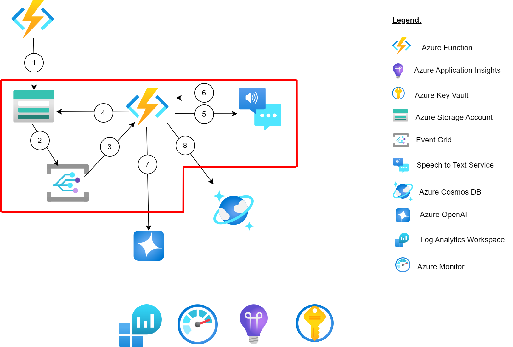

Processing the audio file involves the following actions:
- Detecting file uploads using Blob Storage events and Event Grid
- Creating a transcript of the file using Speech To Text
- Saving the transcript to Azure Cosmos DB
- Generating a summary with Azure OpenAI

To ensure the execution of all these steps and to orchestrate all of this process, you will need a Durable Function which is already created for you in `src/processor`.

Durable Function is an extension of Azure Functions that lets you write stateful functions in a serverless environment. This extension manages state, checkpoints, and restarts for you.

## Detect a file upload event 

Now, you have the audio file uploaded in the storage account. To detect when a new audio is uploaded in the Storage Account an `Event Grid System Topic` was created for you. This Event Grid Subscription listen to the event of uploading in your `audios` container based on this configuration:

- Filter to Event Types: `Blob Created`
- A **Web Hook** event was already created for you, which is targetting the Azure Durable function to trigger the `AudioBlobUploadStart` method.
- This event is only triggerd for `.wav` files

## Consume Speech to Text APIs

The Azure AI Services are cloud-based AI services that give the ability to developers to quickly build intelligent apps thanks to these pre-trained models. They are available through client library SDKs in popular development languages and REST APIs.

AI Services can be categorized into five main areas:

- **Decision:** Content Moderator provides monitoring for possible offensive, undesirable, and risky content. Anomaly Detector allows you to monitor and detect abnormalities in your time series data.
- **Language:** Azure Language service provides several Natural Language Processing (NLP) features to understand and analyze text.
- **Speech:** Speech service includes various capabilities like speech to text, text to speech, speech translation, and many more.
- **Vision:** The Computer Vision service provides you with access to advanced cognitive algorithms for processing images and returning information.
- **Azure OpenAI Service:** Powerful language models including for instance the GPT-3, GPT-4, Codex and Embeddings model series for content generation, summarization, semantic search, natural language to code translation and much more.

You now want to retrieve the transcript out of the audio file uploaded thanks to the speech to text cognitive service.

<div class="task" data-title="Tasks">

> - Because the transcription can be a long process, you will use the monitor pattern of the Azure Durable Functions to call the speech to text batch API and check the status of the transcription until it's done.
> - Inside the folder `src/processor` a skeleton of the orchestration file called `AudioTranscriptionOrchestration.cs` is provided to you.
> - Explore the `SpeechToTextService.cs` file and the `Transcription.cs` model provided to get the transcription.
> - Update the `StartTranscription`, `CheckTranscriptionStatus` and `GetTranscription` methods inside the `AudioTranscriptionOrchestration.cs` file

</div>

<details>
<summary> Toggle solution</summary>

The 3 methods `StartTranscription`, `CheckTranscriptionStatus` and `GetTranscription` are activity functions which represent the basic unit of work in a durable function orchestration. In our context Activity functions are the functions and tasks that are orchestrated in the process to communicate with the Speech To Text service.

The `StartTranscription` method will call the `SpeechToTextService` to be able to start the creation of a batch to run the transcription of an Audio file.

Update the `StartTranscription` method with this content:

```csharp
ILogger logger = executionContext.GetLogger(nameof(StartTranscription));
logger.LogInformation($"Starting transcription of {audioFile.Id}");

var jobUri = await SpeechToTextService.CreateBatchTranscription(audioFile.UrlWithSasToken, audioFile.Id);

logger.LogInformation($"Job uri for {audioFile.Id}: {jobUri}");

return jobUri;
```

By starting the creation of a batch transcription using the `SpeechToTextService` you will receive a job URI for this transcription. This job URI will be used to check the status of the transcription and get the transcription itself.

Then you will need to update the `CheckTranscriptionStatus` function with this code:

```csharp
ILogger logger = executionContext.GetLogger(nameof(CheckTranscriptionStatus));
logger.LogInformation($"Checking the transcription status of {audioFile.Id}");
var status = await SpeechToTextService.CheckBatchTranscriptionStatus(audioFile.JobUri!);
return status;
```

This function will check the status of the transcription using the `SpeechToTextService` and return the status.

Finally, you will need to implement the `GetTranscription` function:

```csharp
ILogger logger = executionContext.GetLogger(nameof(GetTranscription));
var transcription = await SpeechToTextService.GetTranscription(audioFile.JobUri!);
logger.LogInformation($"Transcription of {audioFile.Id}: {transcription}");
return transcription;
```

This function will get the transcription of the audio file using the `SpeechToTextService` and return the transcription.

As you probably noticed, each function use his own logger to log the different steps of the orchestration. This will help you to debug the orchestration if needed.

Each of those functions (`StartTranscription`, `CheckTranscriptionStatus` and `GetTranscription`) are called in the orchestration method `RunOrchestrator`.

</details>

## Deploy to Azure

You can now deploy your `processor` function and upload an audio file to see if the transcription is correctly running and check the logs of your Azure Function to see the different steps of the orchestration running. 

```sh
azd deploy processor
```

## Test the scenario

By now you should have a solution that invoke the execution of an Azure Durable Function responsible for retrieving the audio transcription thanks to a Speech to Text batch processing call. You can try to delete and upload once again the audio file in the storage `audios` container of your Storage Account. You will see the different Activity Functions be called in the Azure Functions logs.

After a few minutes, you should see the transcription of the audio file in the logs of the Azure Function:

For the `StartTranscription` Activity Function:

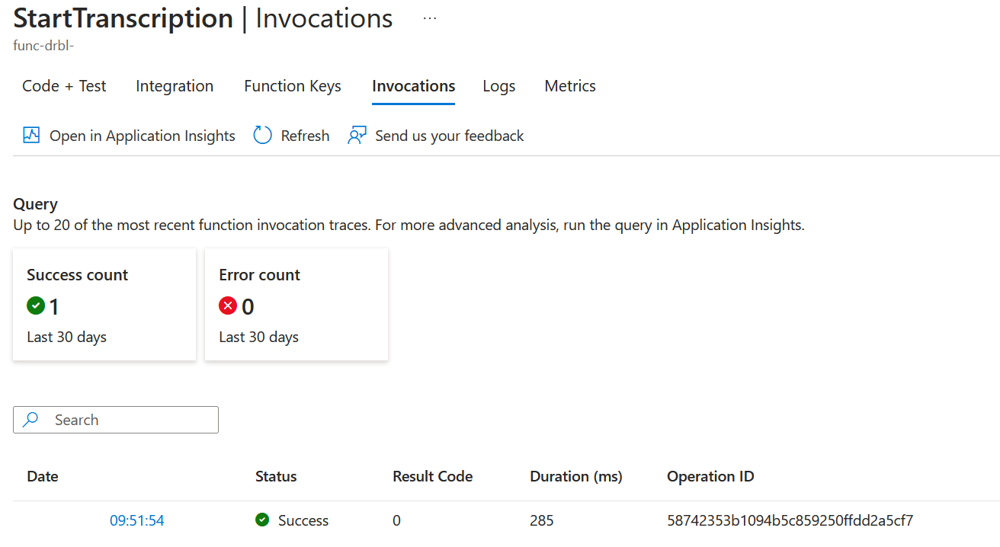

For the `CheckTranscriptionStatus` Activity Function:

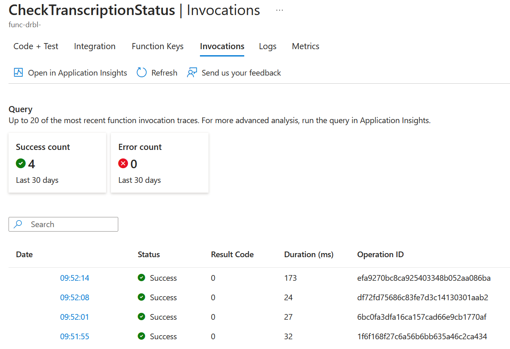

As you can see, multiple calls are made to the `CheckTranscriptionStatus` Activity Function to check the status of the transcription.

For the `GetTranscription` Activity Function:


You should also see a new item created in your Cosmos DB container. Inside **Data Explorer** > **HolDb** in the container called **audios_transcripts**:


You will see also the `SaveTranscription` Activity Functions be called in the Azure Functions logs:

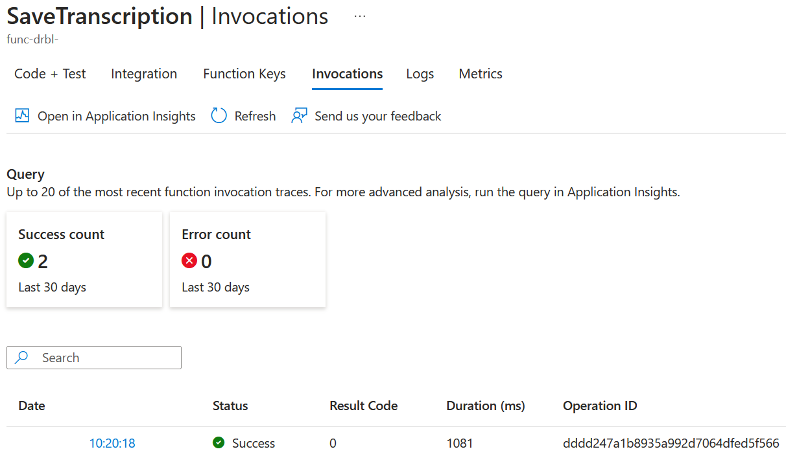

## Lab 2 : Summary

You have now a connection setup between your Azure Durable Function and the Speech to Text service to do the transcription of the audio files.

---

# Lab 3 : Use Azure Functions with Azure OpenAI

In this lab you will use Azure Functions to call the Azure OpenAI service to analyze the transcription of the audio file and add some information to the Cosmos DB entry.

You will go back to the Azure Durable Function you did in the previous lab and add a connection to Azure OpenAI to be able to summarize the transcription you saved.

So the scope of the lab is this one:


## Enrich the transcription with Azure OpenAI

<div class="task" data-title="Tasks">

> - Update the Activity function `EnrichTranscription` inside the `AudioTranscriptionOrchestration.cs` to call Azure OpenAI via `TextCompletionInput`
> - Define a prompt to ask the model to summarize the audio transcription 
> - Use the result to update the `Completion` field of the transcription.

</div>

<details>
<summary> Toggle solution</summary>

First, you need to add the `TextCompletionInput` binding to the `EnrichTranscription` method:

```csharp
[Function(nameof(EnrichTranscription))]
public static AudioTranscription EnrichTranscription(
    [ActivityTrigger] AudioTranscription audioTranscription, FunctionContext executionContext,
    [TextCompletionInput("Summarize {Result}", Model = "%CHAT_MODEL_DEPLOYMENT_NAME%")] TextCompletionResponse response
)
```

The `TextCompletionInput` binding is defining a prompt to ask the model to summarize the audio transcription. It will use the `CHAT_MODEL_DEPLOYMENT_NAME` environment variable to get the model name to use.

This will manage for you the authentication to the Azure OpenAI service and send the transcription to the service to get a summary of the transcription.

Then you just have to consume the `Content` property of the response object and update the `Completion` field of the `AudioTranscription` object:

```csharp
audioTranscription.Completion = response.Content;
```

And that's it, you have now enriched the transcription of the audio file with the Azure OpenAI service!

So, to summarize, the function will look like this:

```csharp
[Function(nameof(EnrichTranscription))]
public static AudioTranscription EnrichTranscription(
    [ActivityTrigger] AudioTranscription audioTranscription, FunctionContext executionContext,
    [TextCompletionInput("Summarize {Result}", Model = "%CHAT_MODEL_DEPLOYMENT_NAME%")] TextCompletionResponse response
)
{
    ILogger logger = executionContext.GetLogger(nameof(EnrichTranscription));
    logger.LogInformation($"Enriching transcription {audioTranscription.Id}");
    audioTranscription.Completion = response.Content;
    return audioTranscription;
}
```

</details>

## Deploy to Azure

You can now redeploy your `processor` function and upload an audio file to see if the transcription is correctly running and check the logs of your Azure Function to see the different steps of the orchestration running. 

```sh
azd deploy processor
```

## Test the scenario

You can try to delete and upload once again the audio file in the storage `audios` container of your Storage Account. You will see the `EnrichTranscription` Activity Functions be called in the Azure Functions logs:


You can play with the prompt of the `TextCompletionInput` if you wan't to have a more specific task based on the transcription.

You should also see a new item created in your Cosmos DB container called **audios_transcripts** with also a property called `completion` with a summary of the audio made by Azure OpenAI:


## Lab 3 : Summary

By now you should have a solution that invoke Azure OpenAI to create a summary of the transcription.

Congratulations!

Well done on completing the lab at Ignite! Your dedication and hard work have truly paid off. Keep up the great work!

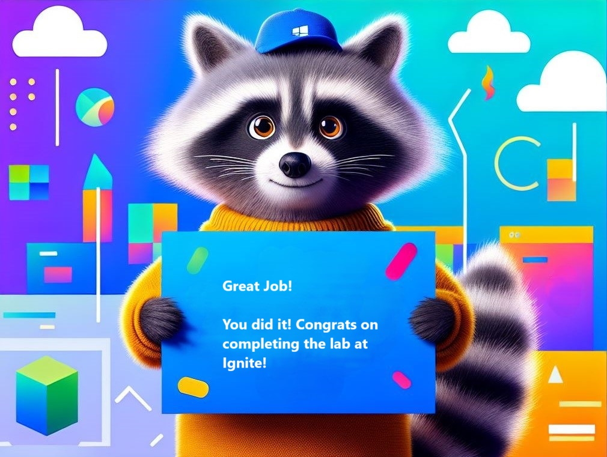

---

# Bonus : Secure your Azure Function with Azure API Management

Let's now integrate the Azure Functions with Azure API Management (APIM) to expose the transcription of the audio file as an API. 

Previously to test your Azure Function you had to get the Function URL with the *default (function key)* to ensure a basic security layer. But in a real-world scenario, you will need to secure your Azure Function and expose it through an API Gateway like Azure API Management.

In fact, with Azure API Management you can expose your Azure Functions as APIs and manage them with policies like authentication, rate limiting, caching, etc. You can manage who can call your Azure Function by providing a subscription key or using OAuth 2.0 authentication.

In this lab you will see how to expose the Azure Function as an API using Azure API Management:

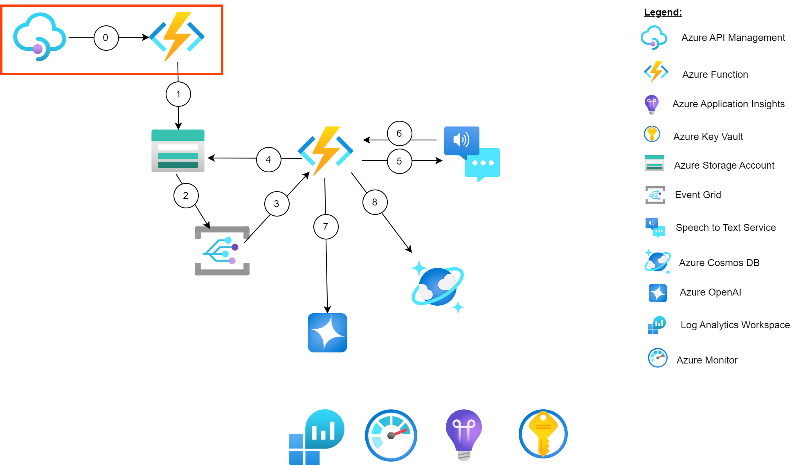

## Define the API in APIM

### Import the Azure Function

Inside your resource group, you should see an APIM instance. Click on it, you will be redirected to the APIM instance overview.

<div class="task" data-title="Tasks">

> - Define the Azure Function (`func-std-`) endpoints as an API in Azure API Management.

</div>

<div class="tip" data-title="Tips">

> - [Import Azure Function Azure API Management][import-azure-function-azure-api-management]<br>

</div>

<details>
<summary>📚 Toggle solution</summary>

First, go to the **APIs** section in the left menu and click on the **+ Add API** button.

Then select the **Function App** option:

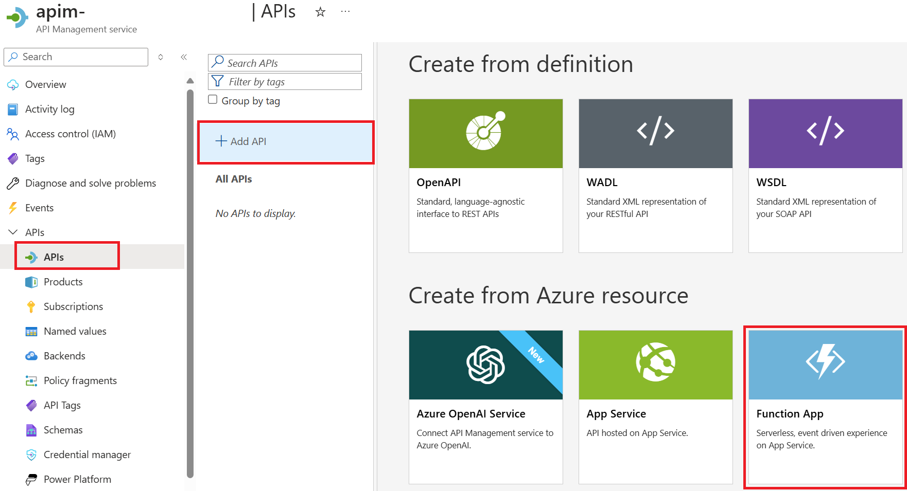

In the popup menu to create a Function select **Browse**, this will redirect you to the list of all Azure Functions in your Subscription. Click on the **Select** button and pick the Azure Function which is responsible for the transcription of the audio file. It should start by `func-std-`.


Then you will see automatically the list of endpoints, select the **AudioUpload** and the **GetTranscriptions** endpoints and click on the **Select** button.

This will fill all the information needed to create the API in APIM, let's update the API details to have something more meaningful.

- **Display name**: `Audio Transcription API`
- **Name**: `audio-transcription-api`
- **API Url Suffix**: `audios-transcriptions`


 You can now click on the **Create** button.

 You should see the new API in the list of APIs in your APIM instance.

</details>

### What happened behind the scenes?

If you navigate to the **Backends** section of your APIM you should see a line pointing to the Azure Function App you just imported:

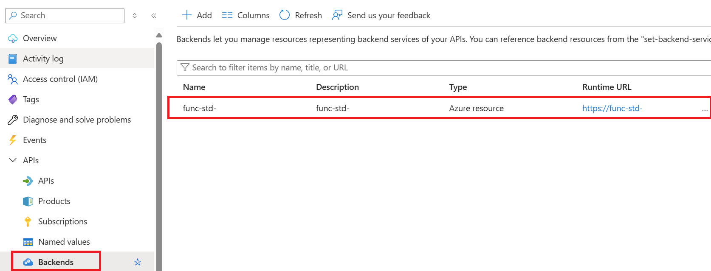

This is a declaration of the Azure Function App as a backend in APIM. This will allow you to call the Azure Function from the API Gateway.

Now, inside the **Named values** section of the APIM you should see a line which represent the storage of the Azure Function **Host keys** to authorize the APIM to call the Azure Function:


This key was created automatically by Azure, if you go in your Azure Function, inside **Functions** > **App keys** you will see an access given to the APIM instance:


So now the APIM instance can call the Azure Function with this key hidden for the user.

When defining an API on APIM you can protect it using different methods like OAuth 2.0, Subscription keys, etc.

If you go to your definition of the API in APIM, in the **Settings** tab you will see the **Subscription required** option. This option allows you to protect your API with a subscription key which should be passed in the header or in the query string of the request:

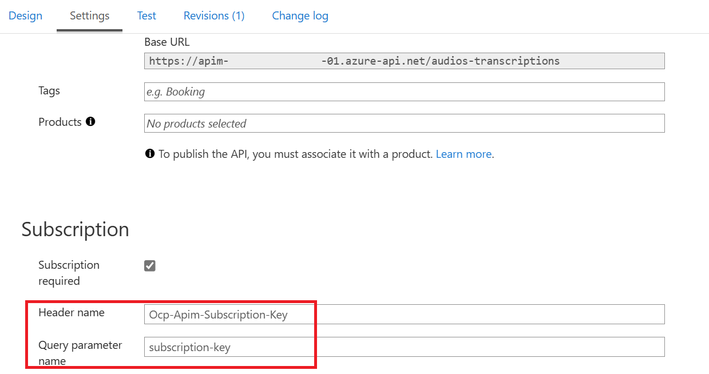

You can specify the **Subscription key header name** and the **Subscription key query parameter name** to define how the subscription key should be passed in the request.

## Call your API

### Test inside APIM

<div class="task" data-title="Tasks">

> - Test your API inside Azure API Management and upload a new audio file .

</div>

<details>
<summary>📚 Toggle solution</summary>

Select your API in the **APIs** section of your APIM instance and click on the **Test** tab, and let's test the `AudioUpload` endpoint:


In the `Request Body` section of the request, select **Binary** and select your audio file to upload. Then click on the **Send** button.

You should see the result of the call with the status code of `200` and the response body like this:


By calling the API from this menu, APIM is automatically adding the subscription key in the header of the request to call the Azure Function. You can see the detail of the request by clicking on the **Trace** button to run the request with all the details of the call. You will see it in the **Trace** tab of the `HTTP response` section.

</details>

### Test inside Postman

Let's test this in Postman to see how it works. Open the Postman application and copy/paste the URL from your API in APIM. It should be inside the **Test** tab:


In Postman, create a new request and paste the URL in the URL field. Select the **Body** tab and select **form-data** as the type of the body. Then define `audios` as a key and select your audio file to upload.

Run the request, and you should see a `401` status code because you need to add the subscription key in the header of the request. In fact the APIM give you the possibility to protect your API with a subscription key.

To do so, go back to your APIM instance and select the **Subscriptions** tab and click on the **+ Add Subscription** button to create a new subscription key dedicated to your API:

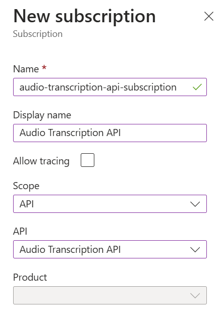

Then you can copy the subscription key and add it in the header of your request in Postman in the `Ocp-Apim-Subscription-Key` key. Run the request again, and you should see a `200` status code:

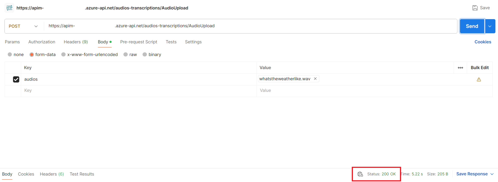


## Bonus : Summary

At the end of this lab you should have an Azure Function exposed as an API via Azure API Management. You should be able to call this API with a subscription key to upload an audio file to the storage account.

[import-azure-function-azure-api-management]: https://learn.microsoft.com/en-us/azure/api-management/import-function-app-as-api

---

# Useful links

You can find the entire lab step by step with a deep dive on Azure Functions in this link:

- [Product Hands-on Lab - Azure Functions deep dive][azure-function-deep-dive]

General topics regarding Azure Functions Flex Consumption:

- [Flex Consumption samples and quickstarts][quick-start-flex]

- [Load test HTTP based Azure Functions][load-testing-for-azure-functions]

- [Performance Optimize HTTP based Flex Consumption apps][performance-improvement]

Deep dive with the GenAI Gateway Landing Zone in the following link:

- [GenAI Gateway Landing Zone][gen-ai-gateway-accelerator]

If you want to see more scenarios regarding APIs and Azure Open AI you can look at this repository:

- [AI-Gateway][azure-apim-open-ai-git-repo]

[azure-apim-open-ai-git-repo]: https://github.com/Azure-Samples/AI-Gateway/tree/main
[azure-function-deep-dive]: https://moaw.dev/workshop/gh:microsoft/hands-on-lab-azure-functions/main/docs/
[gen-ai-gateway-accelerator]: https://aka.ms/apim-genai-lza
[quick-start-flex]: https://aka.ms/flexconsumption/samples
[load-testing-for-azure-functions]: https://learn.microsoft.com/en-us/azure/load-testing/how-to-create-load-test-function-app
[performance-improvement]: https://learn.microsoft.com/en-us/azure/load-testing/how-to-optimize-azure-functions

---

# Closing the workshop

If you are attending an instructor-led session at Ignite, please:

<div class="task" data-title="Task">

> Visit the Skillable Lab page and click End Session to end the session and release all resources. This allows the lab to be run again without quota issues for others.

</div>

If you are doing it outside an instructor-led session at Ignite:

Once you're done with this lab you can delete the resource group you created at the beginning.

To do so, click on `delete resource group` in the Azure Portal to delete all the resources and audio content at once. The following Az-Cli command can also be used to delete the resource group :

```bash
# Delete the resource group with all the resources
az group delete --name <resource-group>
```